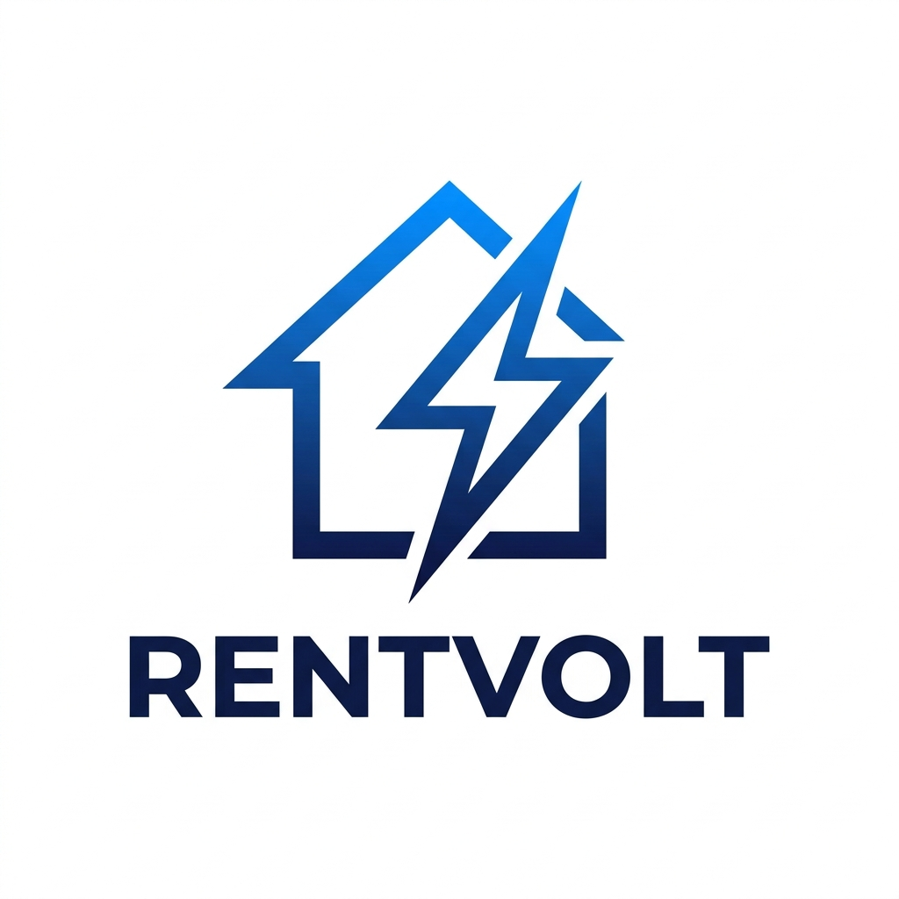

# ⚡ RentVolt API



**Real estate rental data, lightning fast.**

© 2026 Groundwork Labs LLC — California

---

## What is RentVolt?

RentVolt aggregates rental listing data from 6 major sources into a single API call. Built for investors, researchers, property managers, and developers who need rental market intelligence.

### Sources
- Apartments.com ✓
- Zillow ✓
- Rent.com ✓
- RentCafe ✓
- HotPads ✓
- Zumper ✓

## Quick Start

```bash
git clone https://github.com/ZayM511/rentvolt-api.git
cd rentvolt-api
npm install
cp .env.example .env
npm start
```

Server runs at `http://localhost:3000`

## API Endpoints

| Method | Endpoint | Auth | Description |
|--------|----------|------|-------------|
| GET | `/` | No | API info & endpoint list |
| GET | `/health` | No | Health check + uptime |
| GET | `/legal` | No | Company & legal info |
| GET | `/api/verify` | Key | Verify API key + quota |
| GET | `/api/scrape/locations` | No | Supported locations |
| POST | `/api/scrape/listings` | Key | Get rental listings |
| POST | `/api/scrape/bulk` | Key | Bulk multi-city (Basic/Pro) |
| POST | `/api/stripe/checkout` | Key | Upgrade plan |

## Authentication

Include your API key in every request:
```
x-api-key: YOUR_API_KEY
```

**Test Keys:**
| Key | Plan | Requests/mo |
|-----|------|-------------|
| `sk_test_free_001` | Free | 100 |
| `sk_test_basic_002` | Basic | 1,000 |
| `sk_test_pro_003` | Pro | 10,000 |

## Usage Examples

### Get Listings
```bash
curl -X POST http://localhost:3000/api/scrape/listings \
  -H "Content-Type: application/json" \
  -H "x-api-key: sk_test_free_001" \
  -d '{
    "city": "oakland",
    "state": "ca",
    "filters": {
      "maxPrice": 3000,
      "minBeds": 2,
      "sources": ["apartments", "zillow"],
      "sortBy": "price",
      "sortOrder": "asc",
      "limit": 20
    }
  }'
```

### Response
```json
{
  "success": true,
  "listings": [
    {
      "source": "apartments.com",
      "price": 2100,
      "address": "1200 Oakland Blvd, CA",
      "beds": "2 bed",
      "baths": "1 bath",
      "scrapedAt": "2026-04-07T..."
    }
  ],
  "total": 20,
  "sources": { "apartments": 10, "zillow": 10 },
  "query": { "city": "oakland", "state": "ca" },
  "meta": {
    "requestId": "a1b2c3d4e5f6",
    "plan": "free",
    "remaining": 99
  }
}
```

### Bulk Scrape (Basic/Pro only)
```bash
curl -X POST http://localhost:3000/api/scrape/bulk \
  -H "Content-Type: application/json" \
  -H "x-api-key: sk_test_pro_003" \
  -H "x-terms-accepted: true" \
  -d '{
    "locations": [
      { "city": "oakland", "state": "ca" },
      { "city": "san-francisco", "state": "ca" },
      { "city": "seattle", "state": "wa" }
    ],
    "filters": { "maxPrice": 4000 }
  }'
```

## Subscription Plans

| Plan | Price | Requests/mo | Bulk | Sources |
|------|-------|-------------|------|---------|
| Free | $0 | 100 | ❌ | All 6 |
| Basic | $9.99 | 1,000 | ✅ | All 6 |
| Pro | $29.99 | 10,000 | ✅ | All 6 |

## Deployment

### Render
```bash
# render.yaml included — just connect your repo
```

### Docker
```bash
docker build -t rentvolt-api .
docker run -p 3000:3000 --env-file .env rentvolt-api
```

## Features
- ⚡ Parallel scraping across all 6 sources
- 🔑 API key auth with usage tracking & monthly resets
- 📦 Bulk endpoint for multi-city queries
- 🔍 Filter by price, beds, source
- 📊 Sort, limit, deduplicate results
- 🛡️ Helmet security, rate limiting, CORS
- 💳 Stripe subscription integration
- 📋 OpenAPI 3.0 spec included

## Legal

- [Terms of Service](legal/TermsOfService.md)
- [Privacy Policy](legal/PrivacyPolicy.md)
- [Legal Disclaimer](legal/LegalDisclaimer.md)
- [Compliance](legal/Compliance.md)

---

**RentVolt** — A Groundwork Labs LLC Product
© 2026 All Rights Reserved
